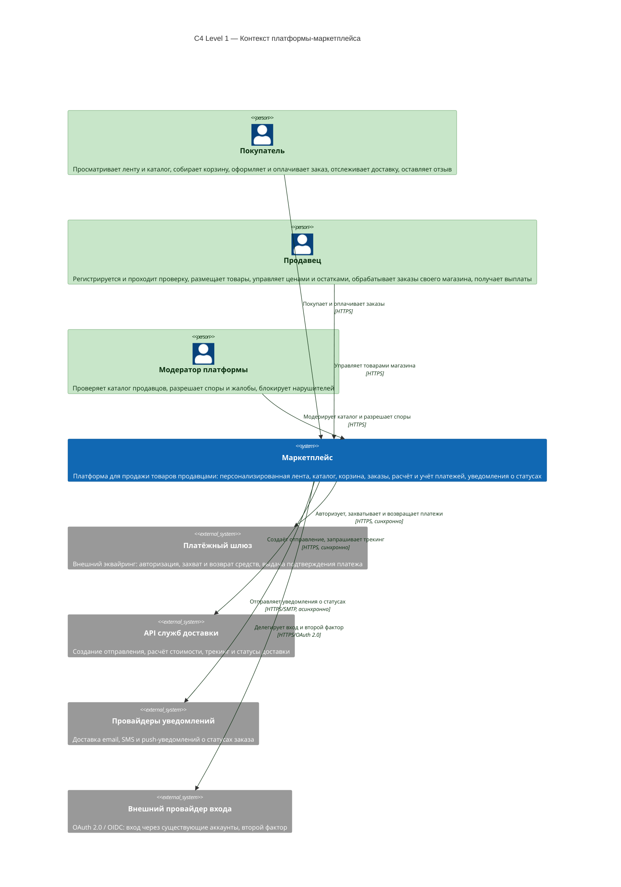

# SOA-1 — Архитектура маркетплейса

Учебное задание: спроектировать архитектуру цифрового маркетплейса, описать её
диаграммой C4 Container и поднять один сервис в Docker с health-check.

**Выполнено 10 баллов из первых восьми критериев:**

| Критерий | Состояние | Где смотреть |
|---|---|---|
| 1. C4 Container диаграмма (2 балла) | выполнено | [Архитектура](#1-архитектура), также [`docs/c4/`](docs/c4/) |
| 2. Сервис в Docker отвечает 200 OK (2 балла) | выполнено | [Запуск проекта](#3-запуск-проекта) |
| 3. Домены и ответственность (1 балл) | выполнено | [Домены и владение данными](docs/c4/03-domains.md#1-домены-и-их-ответственность) |
| 4. Распределение доменов по сервисам (1 балл) | выполнено | [Карта «домен → сервис»](docs/c4/03-domains.md#21-карта-домен--сервис) |
| 5. Границы владения данными (1 балл) | выполнено | [Кто что хранит](docs/c4/03-domains.md#31-кто-что-хранит) |
| 6. Альтернативные варианты декомпозиции (1 балл) | выполнено | [Три варианта в ADR-0001](docs/adr/0001-decomposition-options.md#вариант-а--модульный-монолит): модульный монолит, крупнозернистые сервисы, микросервисы по доменам |
| 7. Trade-off'ы вариантов (1 балл) | выполнено | [Таблица trade-off'ов](docs/adr/0001-decomposition-options.md#trade-offы) |
| 8. Обоснование финального выбора (1 балл) | выполнено | [Обоснование выбора](docs/adr/0001-decomposition-options.md#обоснование-выбора) |

**Быстрый старт**

```bash
docker compose up -d --build
docker compose ps
curl -i http://localhost:8080/health
```

Бизнес-функциональности в сервисе нет — этого требует условие задания.
Реализован ровно минимум из критерия 2: HTTP-сервис, который отвечает `200 OK`
на `/health`, и упаковка этого сервиса в Docker.

---

## Содержание

1. [Архитектура](#1-архитектура)
2. [Реализованный сервис](#2-реализованный-сервис)
3. [Запуск проекта](#3-запуск-проекта)
4. [Структура репозитория](#4-структура-репозитория)
5. [Что дальше](#5-что-дальше)

Отдельно, вне оглавления:

- [Домены, распределение по сервисам и границы владения данными](docs/c4/03-domains.md)
  — критерии 3–5, которые не выражаются диаграммой
- [ADR-0001. Вариант декомпозиции платформы](docs/adr/0001-decomposition-options.md)
  — критерии 6–8: три варианта архитектуры, их trade-off'ы и обоснование выбора

---

## 1. Архитектура

Две диаграммы ниже — это одна и та же система на двух увеличениях C4.
**Контейнерная вскрывает единственный блок, который нарисован на контекстной**:
контекст отвечает на вопрос «нужна ли система и с кем она интегрируется»,
контейнеры — «из чего она собрана». Разница построчная, с маппингом каждого
блока L1 на его содержимое в L2, разобрана в
[`docs/c4/01-context.md`](docs/c4/01-context.md).

### 1.1 C4 Level 1 — контекст платформы

Уровень контекста отвечает на вопрос «нужна ли вообще эта система и с кем она
интегрируется». Внутренности здесь скрыты.


Исходник диаграммы: [`01-context.md`](docs/c4/01-context.md) (Mermaid) и [`workspace.dsl`](docs/c4/workspace.dsl) (Structurizr DSL).

<details>
<summary>Mermaid-исходник диаграммы</summary>



</details>

### 1.2 C4 Level 2 — контейнерная диаграмма маркетплейса

Это основная диаграмма задания. Контейнер в C4 — нечто, что запускается
отдельно: сервис, база данных, брокер, кэш, веб-клиент. Внутренние пакеты
сервиса сюда не попадают, это уже уровень 3.



Исходник диаграммы: [`02-container.md`](docs/c4/02-container.md) (Mermaid) и [`workspace.dsl`](docs/c4/workspace.dsl) (Structurizr DSL).

<details>
<summary>Mermaid-исходник диаграммы</summary>

```mermaid
C4Container
    title C4 Level 2 — Контейнерная диаграмра маркетплейса

    Person(buyer, "Покупатель", "Браузер или мобильное приложение")
    Person(seller, "Продавец", "Личный кабинет магазина")
    Person(moderator, "Модератор", "Проверка каталога, споры, блокировки")

    System_Ext(paymentGateway, "Платёжный шлюз", "Внешний эквайринг: авторизация, захват, возврат")
    System_Ext(carrier, "API служб доставки", "Отправления, тарифы, трекинг")
    System_Ext(msgProviders, "Провайдеры уведомлений", "Email, SMS, push")
    System_Ext(idp, "Внешний провайдер входа", "OAuth 2.0 / OIDC, второй фактор")

    System_Boundary(marketplace, "Маркетплейс") {

        Container(web, "Web Portal", "SPA, TypeScript / React", "Интерфейс покупателя и кабинет продавца. Только представление, доменной логики не содержит")
        Container(gateway, "API Gateway", "Go, net/http", "Единая точка входа: проверка токена, rate limit, маршрутизация запросов к сервисам, единый формат ошибок")

        Container(identity, "Identity Service", "Go, HTTP / JSON", "Регистрация и вход, роли покупателя и продавца, профиль продавца, проверка документов")
        ContainerDb(identityDb, "identity_db", "PostgreSQL 16", "Пользователи, роли, профиль продавца, документы, адресная книга, избранное. Доступ имеет только Identity Service")

        Container(catalog, "Catalog Service", "Go, HTTP / JSON", "Товары, категории, атрибуты, описания, медиа, жизненный цикл карточки: черновик → на проверке → опубликован")
        ContainerDb(catalogDb, "catalog_db", "PostgreSQL 16", "Карточки товаров, категории, атрибуты, ссылки на медиа, отзывы и оценки. Доступ имеет только Catalog Service")

        Container(search, "Search & Personalization Service", "Go, gRPC, OpenSearch", "Поиск по каталогу, сборка персональной ленты: признаки поведения, отбор кандидатов, ранжирование")
        ContainerDb(searchDb, "search_db", "PostgreSQL 16", "Профиль интересов пользователя, история показов и кликов, признаки для ранжирования. Доступ имеет только Search & Personalization")
        Container(searchIndex, "Индекс каталога", "OpenSearch 2", "Инвертированный индекс товаров, реплицируется из событий каталога")

        Container(cart, "Cart Service", "Go, HTTP / JSON", "Корзина покупателя, добавление и удаление позиций, предварительный расчёт суммы")
        ContainerDb(cartDb, "cart_db", "PostgreSQL 16", "Корзины и их позиции. Доступ имеет только Cart Service")

        Container(order, "Order Service", "Go, HTTP / JSON", "Оформление заказа и оркестрация саги: подтверждение, оплата, отправка, компенсации. Единственный владелец жизненного цикла заказа")
        ContainerDb(orderDb, "order_db", "PostgreSQL 16", "Заказы, позиции заказа, состояние саги, журнал переходов статусов. Доступ имеет только Order Service")

        Container(payment, "Payment Service", "Go, HTTP / JSON", "Расчёт и учёт платежей: авторизация, захват, возврат, взаиморасчёты с продавцами и комиссия платформы")
        ContainerDb(paymentDb, "payment_db", "PostgreSQL 16", "Платежи, транзакции, ledger выплат продавцам. Доступ имеет только Payment Service")

        Container(fulfillment, "Fulfillment Service", "Go, HTTP / JSON", "Отправления: выбор склада, передача перевозчику, трекинг, приём возврата")
        ContainerDb(fulfillmentDb, "fulfillment_db", "PostgreSQL 16", "Отправления, события трекинга, условия возврата. Доступ имеет только Fulfillment Service")

        Container(notification, "Notification Service", "Go, consumer", "Уведомления о статусах заказа, шаблоны, выбор канала, защита от дублей")
        ContainerDb(notificationDb, "notification_db", "PostgreSQL 16", "Шаблоны уведомлений, журнал отправок, признаки прочитанного. Доступ имеет только Notification Service")

        Container(broker, "Шина событий", "Kafka 3", "Единая точка обмена событиями между сервисами. Транспорт асинхронных взаимодействий")
        Container(cache, "Кэш", "Redis 7", "Кэш горячих выборок и результатов поиска, распределённая блокировка")
        Container(media, "Хранилище медиа", "S3-совместимое", "Фотографии товаров, документы продавцов, выписки")
    }

    %% --- Доступ людей -----------------------------------------------------
    Rel(buyer, web, "Покупает, оформляет", "HTTPS")
    Rel(seller, web, "Товары магазина", "HTTPS")
    Rel(moderator, web, "Модерирует каталог и споры", "HTTPS")
    Rel(web, idp, "Вход через внешний аккаунт", "OAuth 2.0 / OIDC")

    %% --- Вход в систему ---------------------------------------------------
    Rel(web, gateway, "Запросы к API", "REST / JSON, HTTPS")
    Rel(gateway, identity, "Токен, профиль, роли", "REST / JSON, sync")
    Rel(gateway, catalog, "Каталог товаров продавца", "REST / JSON, sync")
    Rel(gateway, search, "Поиск и персонализированная лента", "gRPC, sync")
    Rel(gateway, cart, "Работа с корзиной", "REST / JSON, sync")
    Rel(gateway, order, "Оформление и статусы заказов", "REST / JSON, sync")

    %% --- Владение данными: сервис -> только своя БД ------------------------
    Rel(identity, identityDb, "SQL", "SQL")
    Rel(catalog, catalogDb, "SQL", "SQL")
    Rel(search, searchDb, "Признаки интересов", "SQL")
    Rel(search, searchIndex, "Поиск и фильтрация", "HTTP")
    Rel(cart, cartDb, "SQL", "SQL")
    Rel(order, orderDb, "SQL", "SQL")
    Rel(payment, paymentDb, "SQL", "SQL")
    Rel(fulfillment, fulfillmentDb, "SQL", "SQL")
    Rel(notification, notificationDb, "Шаблоны и журнал отправок", "SQL")

    %% --- Вспомогательная инфраструктура ------------------------------------
    Rel(catalog, cache, "Горячие выборки каталога", "RESP")
    Rel(search, cache, "Кэш результатов ленты", "RESP")
    Rel(catalog, media, "Фото и документы", "S3 API, async")

    %% --- Синхронные вызовы между сервисами (внутри одного запроса) ---------
    Rel(search, catalog, "Карточка товара и наличие", "REST / JSON, sync")
    Rel(search, identity, "Профиль и интересы", "REST / JSON, sync")
    Rel(order, catalog, "Цена и наличие", "REST / JSON, sync")
    Rel(order, identity, "Данные покупателя", "REST / JSON, sync")
    Rel(order, cart, "Списание и очистка корзины", "REST / JSON, sync")
    Rel(order, payment, "Создание и захват платежа", "REST / JSON, sync")
    Rel(order, fulfillment, "Создание отправления", "REST / JSON, sync")

    %% --- Асинхронные взаимодействия через шину -----------------------------
    Rel(catalog, broker, "", "")
    Rel(order, broker, "", "")
    Rel(payment, broker, "", "")
    Rel(fulfillment, broker, "", "")
    Rel(broker, search, "", "")
    Rel(broker, payment, "", "")
    Rel(broker, fulfillment, "", "")
    Rel(broker, notification, "", "")
    Rel(broker, catalog, "", "")

    %% --- Внешние интеграции ------------------------------------------------
    Rel(payment, paymentGateway, "Авторизация, захват, возврат средств", "HTTPS, sync")
    Rel(fulfillment, carrier, "Создание отправления и запрос трекинга", "HTTPS, sync")
    Rel(notification, msgProviders, "Отправка email, SMS, push", "HTTPS / SMTP, async")

    UpdateElementStyle(catalog, $bgColor="#1168b3", $borderColor="#0b4f87", $fontColor="#ffffff")
    UpdateElementStyle(catalogDb, $bgColor="#1168b3", $borderColor="#0b4f87", $fontColor="#ffffff")
    UpdateElementStyle(broker, $bgColor="#6c4ba6", $borderColor="#4a3273", $fontColor="#ffffff")
    UpdateElementStyle(buyer, $bgColor="#c8e6c9", $borderColor="#2e7d32", $fontColor="#0b2e0f")
    UpdateElementStyle(seller, $bgColor="#c8e6c9", $borderColor="#2e7d32", $fontColor="#0b2e0f")
    UpdateElementStyle(moderator, $bgColor="#c8e6c9", $borderColor="#2e7d32", $fontColor="#0b2e0f")
    UpdateRelStyle(buyer, web, $textColor="#0b2e0f", $lineColor="#0b2e0f")
    UpdateRelStyle(seller, web, $textColor="#0b2e0f", $lineColor="#0b2e0f")
    UpdateRelStyle(moderator, web, $textColor="#0b2e0f", $lineColor="#0b2e0f")
    UpdateRelStyle(web, idp, $textColor="#0b2e0f", $lineColor="#0b2e0f")
    UpdateRelStyle(web, gateway, $textColor="#0b2e0f", $lineColor="#0b2e0f")
    UpdateRelStyle(gateway, identity, $textColor="#0b2e0f", $lineColor="#0b2e0f")
    UpdateRelStyle(gateway, catalog, $textColor="#0b2e0f", $lineColor="#0b2e0f", $offsetX="24")
    UpdateRelStyle(gateway, search, $textColor="#0b2e0f", $lineColor="#0b2e0f")
    UpdateRelStyle(gateway, cart, $textColor="#0b2e0f", $lineColor="#0b2e0f")
    UpdateRelStyle(gateway, order, $textColor="#0b2e0f", $lineColor="#0b2e0f", $offsetX="-24")
    UpdateRelStyle(identity, identityDb, $textColor="#0b2e0f", $lineColor="#0b2e0f")
    UpdateRelStyle(catalog, catalogDb, $textColor="#0b2e0f", $lineColor="#0b2e0f", $offsetY="-20")
    UpdateRelStyle(search, searchDb, $textColor="#0b2e0f", $lineColor="#0b2e0f", $offsetY="20")
    UpdateRelStyle(search, searchIndex, $textColor="#0b2e0f", $lineColor="#0b2e0f", $offsetY="-18")
    UpdateRelStyle(cart, cartDb, $textColor="#0b2e0f", $lineColor="#0b2e0f")
    UpdateRelStyle(order, orderDb, $textColor="#0b2e0f", $lineColor="#0b2e0f")
    UpdateRelStyle(payment, paymentDb, $textColor="#0b2e0f", $lineColor="#0b2e0f")
    UpdateRelStyle(fulfillment, fulfillmentDb, $textColor="#0b2e0f", $lineColor="#0b2e0f")
    UpdateRelStyle(notification, notificationDb, $textColor="#0b2e0f", $lineColor="#0b2e0f", $offsetY="20")
    UpdateRelStyle(catalog, cache, $textColor="#0b2e0f", $lineColor="#0b2e0f")
    UpdateRelStyle(search, cache, $textColor="#0b2e0f", $lineColor="#0b2e0f")
    UpdateRelStyle(catalog, media, $textColor="#0b2e0f", $lineColor="#0b2e0f")
    UpdateRelStyle(search, catalog, $textColor="#0b2e0f", $lineColor="#0b2e0f", $offsetX="-16")
    UpdateRelStyle(search, identity, $textColor="#0b2e0f", $lineColor="#0b2e0f", $offsetY="-14")
    UpdateRelStyle(order, catalog, $textColor="#0b2e0f", $lineColor="#0b2e0f", $offsetY="16")
    UpdateRelStyle(order, identity, $textColor="#0b2e0f", $lineColor="#0b2e0f", $offsetX="18")
    UpdateRelStyle(order, cart, $textColor="#0b2e0f", $lineColor="#0b2e0f")
    UpdateRelStyle(order, payment, $textColor="#0b2e0f", $lineColor="#0b2e0f")
    UpdateRelStyle(order, fulfillment, $textColor="#0b2e0f", $lineColor="#0b2e0f")
    UpdateRelStyle(catalog, broker, $textColor="#0b2e0f", $lineColor="#0b2e0f")
    UpdateRelStyle(order, broker, $textColor="#0b2e0f", $lineColor="#0b2e0f")
    UpdateRelStyle(payment, broker, $textColor="#0b2e0f", $lineColor="#0b2e0f")
    UpdateRelStyle(fulfillment, broker, $textColor="#0b2e0f", $lineColor="#0b2e0f")
    UpdateRelStyle(broker, search, $textColor="#0b2e0f", $lineColor="#0b2e0f")
    UpdateRelStyle(broker, payment, $textColor="#0b2e0f", $lineColor="#0b2e0f")
    UpdateRelStyle(broker, fulfillment, $textColor="#0b2e0f", $lineColor="#0b2e0f")
    UpdateRelStyle(broker, notification, $textColor="#0b2e0f", $lineColor="#0b2e0f")
    UpdateRelStyle(broker, catalog, $textColor="#0b2e0f", $lineColor="#0b2e0f")
    UpdateRelStyle(payment, paymentGateway, $textColor="#0b2e0f", $lineColor="#0b2e0f")
    UpdateRelStyle(fulfillment, carrier, $textColor="#0b2e0f", $lineColor="#0b2e0f")
    UpdateRelStyle(notification, msgProviders, $textColor="#0b2e0f", $lineColor="#0b2e0f")```

</details>

Синим выделен **Catalog Service** — сервис, реализованный в этом ДЗ и поднятый
в Docker. Остальные сервисы пока только спроектированы, это разрешено условием
задания.

### 1.3 Обозначения

| Элемент нотации | Значение в этой диаграмме |
|---|---|
| «Человечек» | Актор: покупатель, продавец, модератор. Находится вне системы |
| Прямоугольник | Контейнер — сервис, БД, брокер, кэш. Всё, что запускается отдельно |
| Форма барабана | База данных. В подписи указано, какому сервису она принадлежит |
| Пунктирная рамка | Граница маркетплейса. Всё вне рамки — не наша ответственность |
| Стрелка с двумя подписями | Сначала назначение, затем технология. `sync` — вызывающий ждёт ответа, `async` — публикация события в шину |

Диаграммы хранятся в трёх видах: Mermaid в этом README, отдельные файлы в
[`docs/c4/`](docs/c4/) и каноническая модель в формате Structurizr
([`docs/c4/workspace.dsl`](docs/c4/workspace.dsl)) — её можно открыть на
[structurizr.com](https://structurizr.com/help/dsl) и экспортировать в PNG или PDF.

Почему каждая связь синхронная или асинхронная, описано в
[`docs/c4/02-container.md`](docs/c4/02-container.md).

---

## 2. Реализованный сервис

### 2.1 Что это

Минимальный HTTP-сервис каталога товаров. Условие задания прямо запрещает
бизнес-функциональность на этом этапе, поэтому сервис делает ровно одну вещь:
отвечает `200 OK` на `/health`. Логирования, метрик, конфигурации и хранилища
тоже нет — всё это требуется отдельными критериями и будет добавлено позже.

### 2.2 Исходный код

Сервис целиком помещается в один файл — 34 строки в
[`services/catalog-service/main.go`](services/catalog-service/main.go). Всё, что
он делает: принимает соединение на порту 8080, отвечает `200 OK` на
`GET /health` и `404` на любой другой путь.

### 2.3 Endpoint

| Метод | Путь | Код | Назначение |
|---|---|---|---|
| GET | `/health` | **200** | Health-check: сервис запущен и отвечает |

Любой другой путь вернёт `404 Not Found` — это поведение стандартного
маршрутизатора `net/http`, специально для этого написано ничего.

### 2.4 Почему Go

- Стандартная библиотека — **ноль внешних зависимостей**, нет `go.sum`, образ
  собирается даже без доступа в интернет.
- Собирается в один файл: нет ни classpath, ни виртуального окружения, ни
  `node_modules`.
- Сборка дешёвая, образ маленький, поэтому его легко проверить на любой машине.

---

## 3. Запуск проекта

### 3.1 Требования

Docker 20.10+ и Docker Compose v2. Go устанавливать не нужно: образ собирается
внутри Docker.

### 3.2 Запуск

```bash
docker compose up -d --build
```

### 3.3 Проверка

```bash
docker compose ps
```

Ожидается:

```
NAME                    IMAGE                       STATUS
soa-catalog-service     soa/catalog-service:0.1.0   Up (healthy)
```

Затем главная проверка задания:

```bash
curl -i http://localhost:8080/health
```

```
HTTP/1.1 200 OK
Content-Type: application/json; charset=utf-8

{"status":"ok"}
```

Статус `healthy` выставляет `HEALTHCHECK` из `Dockerfile`: движок Docker каждые
10 секунд выполняет внутри контейнера
`wget -q -O /dev/null http://127.0.0.1:8080/health` и считает контейнер
здоровым, если команда завершилась с кодом 0.

### 3.4 Остановка и пересборка

```bash
docker compose down                          # остановить
docker compose up -d --build                 # пересобрать образ и перезапустить
docker compose logs -f catalog-service       # посмотреть логи
```

### 3.5 Если не заработало

| Симптом | Причина | Что делать |
|---|---|---|
| `port is already allocated` | Порт 8080 на хосте занят другой программой | Найти процесс командой `ss -ltnp` и освободить порт, либо поменять `"8080:8080"` в `docker-compose.yml` |

---

## 4. Структура репозитория

```
.
├── README.md                      Этот файл: диаграммы, решения, инструкция запуска
├── docker-compose.yml             Сборка и запуск сервиса
├── .gitignore
├── docs/
│   ├── adr/
│   │   └── 0001-decomposition-options.md   Критерии 6-8: варианты, trade-off'ы, выбор
│   └── c4/
│       ├── 01-context.md          C4 Level 1 — контекст платформы
│       ├── 02-container.md        C4 Level 2 — контейнеры, таблица связей
│       ├── 03-domains.md          Домены, распределение, владение данными
│       └── workspace.dsl          Каноническая модель в формате Structurizr
└── services/
    └── catalog-service/
        ├── main.go                Исходный код сервиса
        ├── go.mod                 Модуль Go, без зависимостей
        ├── Dockerfile             Двухэтапная сборка, HEALTHCHECK
        └── .dockerignore
```

---

## 5. Что дальше

Критерии 1–8 закрыты, это 10 баллов. Осталось то, что в задании числится
дальше, но в первые восемь критериев не входит:

| Что | Содержание | Состояние |
|---|---|---|
| ~~Домены и ответственность~~ | Критерий 3 | Закрыто: [`docs/c4/03-domains.md`](docs/c4/03-domains.md) |
| ~~Распределение доменов по сервисам~~ | Критерий 4 | Закрыто: [карта и правило разбиения](docs/c4/03-domains.md#2-распределение-доменов-по-сервисам) |
| ~~Границы владения данными~~ | Критерий 5 | Закрыто: [таблица владения](docs/c4/03-domains.md#3-границы-владения-данными) |
| ~~Варианты декомпозиции~~ | Критерий 6 | Закрыто: [три варианта в ADR-0001](docs/adr/0001-decomposition-options.md#что-варьируется) — монолит, крупнозернистые сервисы, микросервисы |
| ~~Trade-off'ы~~ | Критерий 7 | Закрыто: [таблица trade-off'ов](docs/adr/0001-decomposition-options.md#trade-offы) |
| ~~Обоснование выбора~~ | Критерий 8 | Закрыто: [обоснование и цена](docs/adr/0001-decomposition-options.md#обоснование-выбора) |
| ~~ADR~~ | Запись решения | Закрыто: [`docs/adr/0001`](docs/adr/0001-decomposition-options.md) оформлен по шаблону ADR |
| Степень персонализации | Какой уровень персонализации ленты выбран и как он реализуется | не выполнено |

### Что ещё можно доделать в документации

Не влияет на баллы, но заметно на защите:

- В `docs/c4/01-context.md` в перечне написано 22 контейнера, а перечислено
  21 — не назван `Индекс каталога (OpenSearch)`
- Там же: «Модератор» в таблице взаимодействий и «Модератор платформы» в
  диаграмме — стоит выбрать одну формулировку
- Подпись связи `API Gateway → Catalog` звучит как «Каталог товаров продавца»,
  хотя сервис общий для покупателей и продавцов
- В `services/catalog-service/Dockerfile` контейнер работает от `root`: стоит
  добавить `USER app`
