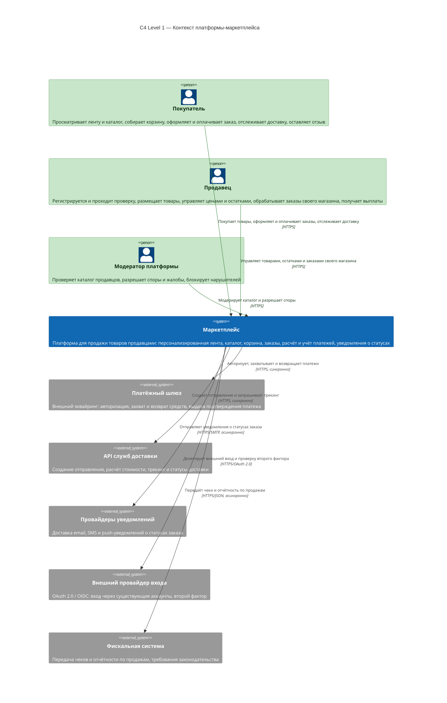

# SOA-1 — Архитектура маркетплейса

Учебное задание: спроектировать архитектуру цифрового маркетплейса, описать её
диаграммой C4 Container и поднять один сервис в Docker с health-check.

**Выполнен блок «4 балла»:**

| Критерий | Состояние | Где смотреть |
|---|---|---|
| 1. C4 Container диаграмма (2 балла) | выполнено | [Архитектура](#1-архитектура), также [`docs/c4/`](docs/c4/) |
| 2. Сервис в Docker отвечает 200 OK (2 балла) | выполнено | [Запуск проекта](#3-запуск-проекта) |
| 3–8. Домены, границы данных, варианты декомпозиции | ещё не выполнено | [Что дальше](#5-что-дальше) |

Бизнес-функциональности в сервисе нет — этого требует условие задания.
Реализован ровно минимум из критерия 2: HTTP-сервис, который отвечает `200 OK`
на `/health`, и упаковка этого сервиса в Docker.

---

## Содержание

1. [Архитектура](#1-архитектура)
2. [Реализованный сервис](#2-реализованный-сервис)
3. [Запуск проекта](#3-запуск-проекта)
4. [Структура репозитория](#4-структура-репозитория)
5. [Что дальше](#5-что-дальше)

---

## 1. Архитектура

### 1.1 C4 Level 1 — контекст платформы

Уровень контекста отвечает на вопрос «нужна ли вообще эта система и с кем она
интегрируется». Внутренности здесь скрыты.



### 1.2 C4 Level 2 — контейнерная диаграмма маркетплейса

Это основная диаграмма задания. Контейнер в C4 — нечто, что запускается
отдельно: сервис, база данных, брокер, кэш, веб-клиент. Внутренние пакеты
сервиса сюда не попадают, это уже уровень 3.

```mermaid
C4Container
    title C4 Level 2 — Контейнерная диаграмма маркетплейса

    Person(buyer, "Покупатель", "Браузер или мобильное приложение")
    Person(seller, "Продавец", "Личный кабинет магазина")
    Person(moderator, "Модератор", "Проверка каталога, споры, блокировки")

    System_Ext(paymentGateway, "Платёжный шлюз", "Внешний эквайринг: авторизация, захват, возврат")
    System_Ext(carrier, "API служб доставки", "Отправления, тарифы, трекинг")
    System_Ext(msgProviders, "Провайдеры уведомлений", "Email, SMS, push")
    System_Ext(idp, "Внешний провайдер входа", "OAuth 2.0 / OIDC, второй фактор")

    System_Boundary(marketplace, "Маркетплейс") {

        Container(web, "Web Portal", "SPA, TypeScript / React", "Интерфейс покупателя и кабинет продавца. Только представление, доменной логики не содержит")
        Container(gateway, "API Gateway", "Go, net/http", "Единая точка входа: проверка токена, rate limit, маршрутизация запросов к сервисам, единый формат ошибок")

        Container(identity, "Identity Service", "Go, HTTP / JSON", "Регистрация и вход, роли покупателя и продавца, профиль продавца, проверка документов")
        ContainerDb(identityDb, "identity_db", "PostgreSQL 16", "Пользователи, роли, профили продавцов. Доступ имеет только Identity Service")

        Container(catalog, "Catalog Service", "Go, HTTP / JSON", "Товары, категории, атрибуты, описания, медиа, жизненный цикл карточки: черновик → на проверке → опубликован")
        ContainerDb(catalogDb, "catalog_db", "PostgreSQL 16", "Карточки товаров, категории, атрибуты, ссылки на медиа. Доступ имеет только Catalog Service")

        Container(search, "Search & Personalization Service", "Go, gRPC, OpenSearch", "Поиск по каталогу, сборка персональной ленты: признаки поведения, отбор кандидатов, ранжирование")
        ContainerDb(searchDb, "search_db", "PostgreSQL 16", "Профиль интересов пользователя, история показов и кликов, признаки для ранжирования")
        Container(searchIndex, "Индекс каталога", "OpenSearch 2", "Инвертированный индекс товаров, реплицируется из событий каталога")

        Container(cart, "Cart Service", "Go, HTTP / JSON", "Корзина покупателя, добавление и удаление позиций, предварительный расчёт суммы")
        ContainerDb(cartDb, "cart_db", "PostgreSQL 16", "Корзины и их позиции. Доступ имеет только Cart Service")

        Container(order, "Order Service", "Go, HTTP / JSON", "Оформление заказа и оркестрация саги: подтверждение, оплата, отправка, компенсации. Единственный владелец жизненного цикла заказа")
        ContainerDb(orderDb, "order_db", "PostgreSQL 16", "Заказы, позиции заказа, состояние саги, журнал переходов статусов")

        Container(payment, "Payment Service", "Go, HTTP / JSON", "Расчёт и учёт платежей: авторизация, захват, возврат, взаиморасчёты с продавцами и комиссия платформы")
        ContainerDb(paymentDb, "payment_db", "PostgreSQL 16", "Платежи, транзакции, ledger выплат продавцам. Доступ имеет только Payment Service")

        Container(fulfillment, "Fulfillment Service", "Go, HTTP / JSON", "Отправления: выбор склада, передача перевозчику, трекинг, приём возврата")
        ContainerDb(fulfillmentDb, "fulfillment_db", "PostgreSQL 16", "Отправления, события трекинга, условия возврата")

        Container(notification, "Notification Service", "Go, consumer", "Уведомления о статусах заказа, шаблоны, выбор канала, защита от дублей")
        ContainerDb(notificationDb, "notification_db", "PostgreSQL 16", "Шаблоны уведомлений, журнал отправок, признаки прочитанного")

        Container(broker, "Шина событий", "Kafka 3", "Единая точка обмена событиями между сервисами. Транспорт асинхронных взаимодействий")
        Container(cache, "Кэш", "Redis 7", "Кэш горячих выборок и результатов поиска, распределённая блокировка")
        Container(media, "Хранилище медиа", "S3-совместимое", "Фотографии товаров, документы продавцов, выписки")
    }

    Rel(buyer, web, "Покупает товары, оформляет заказ, следит за доставкой", "HTTPS")
    Rel(seller, web, "Управляет товарами, остатками и заказами магазина", "HTTPS")
    Rel(moderator, web, "Модерирует каталог и споры", "HTTPS")
    Rel(web, idp, "Вход через внешний аккаунт", "OAuth 2.0 / OIDC")

    Rel(web, gateway, "Запросы к API", "REST / JSON, HTTPS")
    Rel(gateway, identity, "Проверка токена, профиль, роли", "REST / JSON, sync")
    Rel(gateway, catalog, "Каталог товаров продавца", "REST / JSON, sync")
    Rel(gateway, search, "Поиск и персонализированная лента", "gRPC, sync")
    Rel(gateway, cart, "Работа с корзиной", "REST / JSON, sync")
    Rel(gateway, order, "Оформление и статусы заказов", "REST / JSON, sync")

    Rel(identity, identityDb, "Чтение и запись", "SQL")
    Rel(catalog, catalogDb, "Чтение и запись", "SQL")
    Rel(search, searchDb, "Признаки и профиль интересов", "SQL")
    Rel(search, searchIndex, "Поиск и фильтрация", "HTTP")
    Rel(cart, cartDb, "Чтение и запись", "SQL")
    Rel(order, orderDb, "Чтение и запись", "SQL")
    Rel(payment, paymentDb, "Чтение и запись", "SQL")
    Rel(fulfillment, fulfillmentDb, "Чтение и запись", "SQL")
    Rel(notification, notificationDb, "Шаблоны и журнал отправок", "SQL")

    Rel(catalog, cache, "Горячие выборки каталога", "RESP")
    Rel(search, cache, "Кэш результатов ленты", "RESP")
    Rel(catalog, media, "Фото товаров, документы продавца", "S3 API, async")

    Rel(search, catalog, "Карточка товара и наличие", "REST / JSON, sync")
    Rel(search, identity, "Профиль покупателя и его интересы", "REST / JSON, sync")
    Rel(order, catalog, "Проверка цены и наличия на момент заказа", "REST / JSON, sync")
    Rel(order, identity, "Данные покупателя и продавца", "REST / JSON, sync")
    Rel(order, cart, "Списание и очистка корзины", "REST / JSON, sync")
    Rel(order, payment, "Создание, авторизация и захват платежа", "REST / JSON, sync")
    Rel(order, fulfillment, "Создание отправления", "REST / JSON, sync")

    Rel(catalog, broker, "Публикует product.created / product.updated / product.removed", "Kafka, async")
    Rel(order, broker, "Публикует order.created / order.paid / order.closed", "Kafka, async")
    Rel(payment, broker, "Публикует payment.captured / payment.refunded", "Kafka, async")
    Rel(fulfillment, broker, "Публикует shipment.created / shipment.delivered", "Kafka, async")
    Rel(broker, search, "Перестраивает индекс и признаки для ленты", "Kafka, async")
    Rel(broker, payment, "Заказ оплачен: авторизация и захват", "Kafka, async")
    Rel(broker, fulfillment, "Заказ оплачен: создать отправление", "Kafka, async")
    Rel(broker, notification, "Изменения статусов заказа, оплаты и доставки", "Kafka, async")
    Rel(broker, catalog, "Снятие товара с продажи, если нет остатка", "Kafka, async")

    Rel(payment, paymentGateway, "Авторизация, захват, возврат средств", "HTTPS, sync")
    Rel(fulfillment, carrier, "Создание отправления и запрос трекинга", "HTTPS, sync")
    Rel(notification, msgProviders, "Отправка email, SMS, push", "HTTPS / SMTP, async")

    UpdateElementStyle(catalog, $bgColor="#1168b3", $borderColor="#0b4f87", $fontColor="#ffffff")
    UpdateElementStyle(catalogDb, $bgColor="#1168b3", $borderColor="#0b4f87", $fontColor="#ffffff")
    UpdateElementStyle(broker, $bgColor="#6c4ba6", $borderColor="#4a3273", $fontColor="#ffffff")
    UpdateElementStyle(buyer, $bgColor="#c8e6c9", $borderColor="#2e7d32", $fontColor="#0b2e0f")
    UpdateElementStyle(seller, $bgColor="#c8e6c9", $borderColor="#2e7d32", $fontColor="#0b2e0f")
    UpdateElementStyle(moderator, $bgColor="#c8e6c9", $borderColor="#2e7d32", $fontColor="#0b2e0f")
    UpdateRelStyle(buyer, web, $textColor="#0b2e0f", $lineColor="#2e7d32", $textOnEdge="true")
    UpdateRelStyle(seller, web, $textColor="#0b2e0f", $lineColor="#2e7d32", $textOnEdge="true")
    UpdateRelStyle(moderator, web, $textColor="#0b2e0f", $lineColor="#2e7d32", $textOnEdge="true")
```



Синим выделен **Catalog Service** — сервис, реализованный в этом ДЗ и поднятый
в Docker. Остальные сервисы пока только спроектированы, это разрешено условием
задания.

### 1.3 Обозначения

| Элемент нотации | Значение в этой диаграмме |
|---|---|
| «Человечек» | Актор: покупатель, продавец, модератор. Находится вне системы |
| Прямоугольник | Контейнер — сервис, БД, брокер, кэш. Всё, что запускается отдельно |
| Форма барабана | База данных. В подписи указано, какому сервису она принадлежит |
| Пунктирная рамка | Граница маркетплейса. Всё вне рамки — не наша ответственность |
| Стрелка с двумя подписями | Сначала назначение, затем технология. `sync` — вызывающий ждёт ответа, `async` — публикация события в шину |

Диаграммы хранятся в трёх видах: Mermaid в этом README, отдельные файлы в
[`docs/c4/`](docs/c4/) и каноническая модель в формате Structurizr
([`docs/c4/workspace.dsl`](docs/c4/workspace.dsl)) — её можно открыть на
[structurizr.com](https://structurizr.com/help/dsl) и экспортировать в PNG или PDF.

Почему каждая связь синхронная или асинхронная, описано в
[`docs/c4/02-container.md`](docs/c4/02-container.md).

---

## 2. Реализованный сервис

### 2.1 Что это

Минимальный HTTP-сервис каталога товаров. Условие задания прямо запрещает
бизнес-функциональность на этом этапе, поэтому сервис делает ровно одну вещь:
отвечает `200 OK` на `/health`. Логирования, метрик, конфигурации и хранилища
тоже нет — всё это требуется отдельными критериями и будет добавлено позже.

### 2.2 Исходный код

Сервис целиком помещается в один файл — 34 строки в
[`services/catalog-service/main.go`](services/catalog-service/main.go). Всё, что
он делает: принимает соединение на порту 8080, отвечает `200 OK` на
`GET /health` и `404` на любой другой путь.

### 2.3 Endpoint

| Метод | Путь | Код | Назначение |
|---|---|---|---|
| GET | `/health` | **200** | Health-check: сервис запущен и отвечает |

Любой другой путь вернёт `404 Not Found` — это поведение стандартного
маршрутизатора `net/http`, специально для этого написано ничего.

### 2.4 Почему Go

- Стандартная библиотека — **ноль внешних зависимостей**, нет `go.sum`, образ
  собирается даже без доступа в интернет.
- Собирается в один файл: нет ни classpath, ни виртуального окружения, ни
  `node_modules`.
- Сборка дешёвая, образ маленький, поэтому его легко проверить на любой машине.

---

## 3. Запуск проекта

### 3.1 Требования

Docker 20.10+ и Docker Compose v2. Go устанавливать не нужно: образ собирается
внутри Docker.

### 3.2 Запуск

```bash
docker compose up -d --build
```

### 3.3 Проверка

```bash
docker compose ps
```

Ожидается:

```
NAME                    IMAGE                       STATUS
soa-catalog-service     soa/catalog-service:0.1.0   Up (healthy)
```

Затем главная проверка задания:

```bash
curl -i http://localhost:8080/health
```

```
HTTP/1.1 200 OK
Content-Type: application/json; charset=utf-8

{"status":"ok"}
```

Статус `healthy` выставляет `HEALTHCHECK` из `Dockerfile`: движок Docker каждые
10 секунд выполняет внутри контейнера
`wget -q -O /dev/null http://127.0.0.1:8080/health` и считает контейнер
здоровым, если команда завершилась с кодом 0.

### 3.4 Остановка и пересборка

```bash
docker compose down                          # остановить
docker compose up -d --build                 # пересобрать образ и перезапустить
docker compose logs -f catalog-service       # посмотреть логи
```

### 3.5 Если не заработало

| Симптом | Причина | Что делать |
|---|---|---|
| `port is already allocated` | Порт 8080 на хосте занят другой программой | Найти процесс командой `ss -ltnp` и освободить порт, либо поменять `"8080:8080"` в `docker-compose.yml` |

---

## 4. Структура репозитория

```
.
├── README.md                      Этот файл: диаграммы, решения, инструкция запуска
├── docker-compose.yml             Сборка и запуск сервиса
├── .gitignore
├── docs/
│   └── c4/
│       ├── 01-context.md          C4 Level 1 — контекст платформы
│       ├── 02-container.md        C4 Level 2 — контейнеры, таблица связей
│       └── workspace.dsl          Каноническая модель в формате Structurizr
└── services/
    └── catalog-service/
        ├── main.go                Исходный код сервиса
        ├── go.mod                 Модуль Go, без зависимостей
        ├── Dockerfile             Двухэтапная сборка, HEALTHCHECK
        └── .dockerignore
```

---

## 5. Что дальше

Блок «4 балла» закрыт. Остались критерии, которые оцениваются после него
последовательно, поэтому пока не выполнены:

| Что | Содержание |
|---|---|
| Домены и ответственность | Перечень доменов маркетплейса с описанием зоны ответственности каждого |
| Распределение доменов по сервисам | Таблица «домен → сервис» и правило, по которому выполнено разбиение |
| Границы владения данными | Что хранит каждый сервис, какие данные нельзя читать напрямую, матрица взаимодействий sync/async |
| Варианты декомпозиции | Минимум два существенно разных варианта: модульный монолит, микросервисы по доменам, крупнозернистые сервисы |
| Trade-off'ы | Плюсы, минусы и цена каждого варианта |
| Обоснование выбора | Почему выбран конкретный вариант, опираясь на требования кейса и ограничения |
| Степень персонализации | Какой уровень персонализации ленты выбран и как он реализуется |
| ADR | Зафиксированные архитектурные решения с обоснованием |
