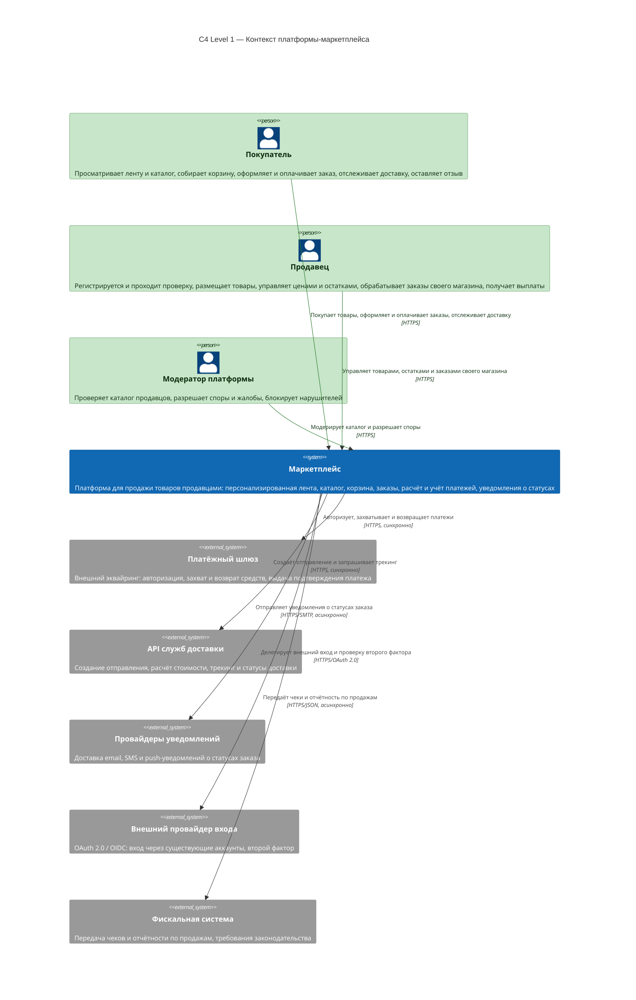

# C4 Level 1 — System Context

Цель диаграммы: показать маркетплейс **как чёрный ящик** — кто с ним общается и какие внешние системы он вызывает. Внутренности скрыты, они раскрыты на [уровне 2](02-container.md).

Обозначения по нотации C4: прямоугольник со скруглёнными краями — система, «человечек» — человек, пунктирная рамка — граница системы, стрелка с подписью — взаимодействие с указанием технологии.

## Что здесь намеренно не показано

- Внутренние сервисы — это уровень 2, см. [02-container.md](02-container.md).
- Классы и модули внутри сервиса — уровень 3, в объём ДЗ не входит.
- Развёртывание на узлы (Node, зоны) — уровень 4, будет описано позже.

## Как читать

Если непонятно, зачем вообще два уровня: контекст отвечает на вопрос **«нужна ли вообще эта система и с кем она интегрируется»**, а контейнерный — **«из чего она собрана»**. Проверяющий сначала смотрит контекст, чтобы понять границы договора, и только потом погружаться во внутренности.
