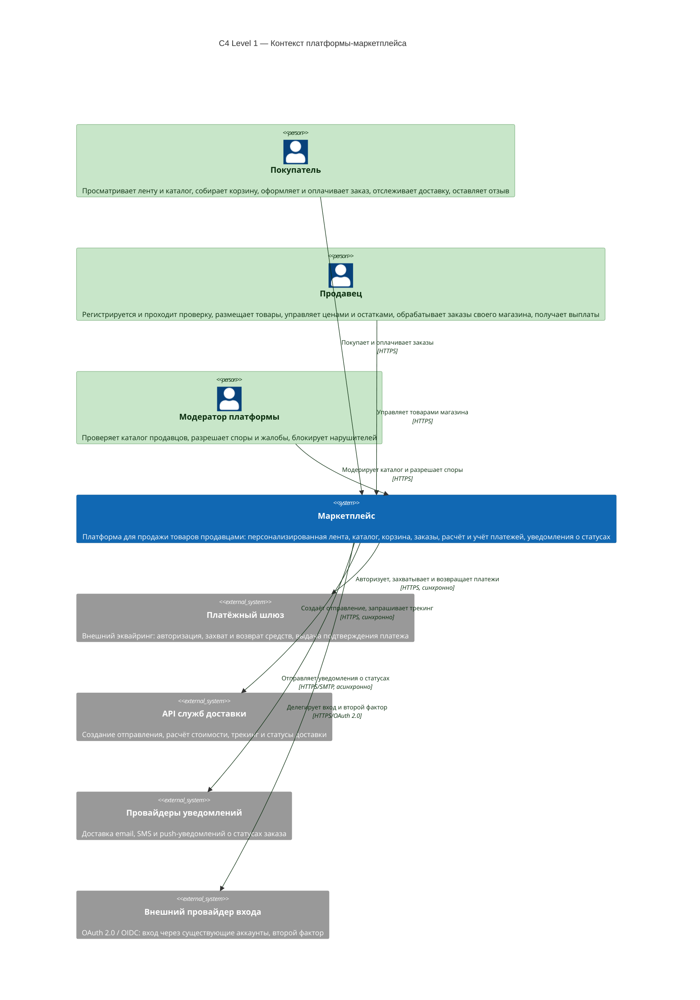

# C4 Level 1 — Context Diagram

| Ящик на L1 (контекст) | Что раскрывает L2 (контейнеры) |
|---|---|
| `Маркетплейс` — один чёрный ящик | граница с 22 контейнерами: Web Portal, API Gateway, 8 сервисов, 8 баз данных, Kafka, Redis, S3 |
| `Покупатель` | ничего — люди не раскрываются ни на каком уровне |
| `Продавец` | ничего — люди не раскрываются ни на каком уровне |
| `Модератор` | ничего — люди не раскрываются ни на каком уровне |
| `Платёжный шлюз` | `Payment` → шлюз, HTTPS, sync |
| `API служб доставки` | `Fulfillment` → доставка, HTTPS, sync |
| `Провайдеры уведомлений` | `Notification` → провайдеры, HTTPS/SMTP, async |
| `Внешний провайдер входа` | `Web Portal` → OAuth 2.0 / OIDC |

| Отправитель | Получатель | Способ | Синхронность | Зачем |
|---|---|---|---|---|
| Покупатель | Маркетплейс | HTTPS | sync | Лента, каталог, корзина, оформление и оплата заказа |
| Продавец | Маркетплейс | HTTPS | sync | Свои товары, цены и остатки, заказы магазина, выплаты |
| Модератор | Маркетплейс | HTTPS | sync | Проверка каталога, споры, блокировки нарушителей |
| Маркетплейс | Платёжный шлюз | HTTPS | sync | Эквайринг: авторизация, захват и возврат средств |
| Маркетплейс | API служб доставки | HTTPS | sync | Тарифы, создание отправления, трекинг статусов |
| Маркетплейс | Провайдеры уведомлений | HTTPS / SMTP | **async** | Email, SMS и push о статусах заказа |
| Маркетплейс | Внешний провайдер входа | HTTPS / OAuth 2.0 | sync | Вход через существующий аккаунт, второй фактор |

Mermaid-исходник диаграммы

